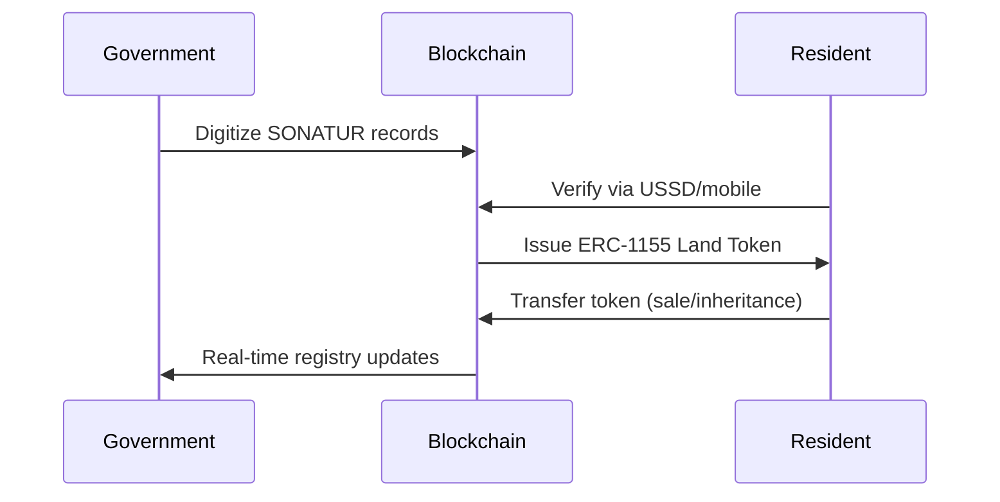
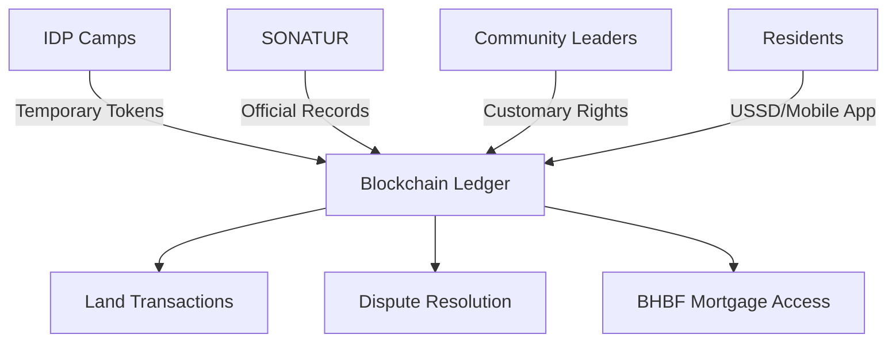
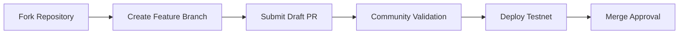

#   
# Land Guard: Ouagadougou Implementation

**Resolving Multiple Allocations and Securing Land Rights**  
*Digital Solutions for Urban Expansion Challenges in Burkina Faso*

---

## Overview

**Land Guard** is a blockchain-powered land registry system specifically designed to address Ouagadougou's critical land management challenges. This implementation transforms disputed and informal land records into secure, tamper-proof digital assets using ERC-1155 tokens on Avalanche's DFK Chain. Our solution directly targets:
- Multiple plot allocations to different parties
- Spontaneous shantytown expansion
- Unreliable government databases
- Social conflicts from overlapping land claims

By creating an immutable ownership ledger accessible via mobile devices, we enable transparent land governance while preserving Burkina Faso's customary land practices.

---

## Ouagadougou Context: The Land Crisis

### Core Challenges
- 🏙️ **Urban Explosion:** 78% city expansion (2003-2021) creating informal settlements
- ⚖️ **Allocation Conflicts:** 58,177 applications vs 15,243 available plots in relay-cities program
- 📜 **Document Duplication:** Same plots allocated to multiple families
- 🛑 **Social Fragmentation:** Death threats and violence between competing claimants
- 🏃 **Displacement Pressure:** 700,000+ IDPs competing for urban housing

### Impact Assessment
| **Metric** | **Current Status** | **Projected Improvement** |
|------------|--------------------|---------------------------|
| Formal Plot Registration | 30.86% | 75%+ |
| Land Dispute Resolution Time | 6+ months | Instant |
| Housing Development Cost | $12,294/unit | 30% reduction |
| Shantytown Formation Rate | 12% annual growth | 40% reduction |

---

## Technical Adaptation for Ouagadougou

### Solution Architecture


### Key Innovations
1. **Conflict Resolution Module**  
   - Flags plots with multiple claims for administrative review
   - Stores competing documents on IPFS for audit trails

2. **Hybrid Identity Verification**  
   - National ID integration + biometric validation
   - Custom roles for customary land stewards

3. **Displacement Response Protocol**  
   - IDP-specific tokens with upgrade paths
   - UNHCR database integration

4. **Accessibility Infrastructure**  
   - USSD interface for feature phones (no internet required)
   - Community kiosks with offline transaction signing

---

## Protocol Deployment

- **Network:** DFK Chain (Avalanche Subnet)
- **Smart Contract Explorer:**  
  [View on Avalanche Subnet Explorer](https://subnets-test.avax.network/defi-kingdoms/address/0x4E5446D1De4cd3c6A6a81D6F64d3E323D8c8ee6D)
- **Local Partners:**  
  National Society for Urban Land (SONATUR) • Banque de l'Habitat (BHBF) • Association for Environmental Management

---

## Implementation Roadmap

| Phase | Objectives | Key Metrics |
|-------|------------|-------------|
| **Pilot (1  mos)** | Register 5,000 SONATUR plots | 95% dispute resolution rate |
| **Scale ( 4 mos)** | Cover spontaneous settlements | 70% informal area coverage |
| **National (12 mos)** | Integrate with BHBF mortgage system | 30% housing deficit reduction |

---

## Core Features

| Feature | Impact in Ouagadougou Context |
|---------|-------------------------------|
| **Conflict-Resistant Tokens** | Prevents multiple allocations through blockchain validation |
| **Mobile Verification** | Enables USSD ownership checks in shantytowns without internet |
| **Customary Rights Integration** | Recognizes traditional land stewards through multi-sig wallets |
| **Dispute Arbitration Ledger** | Timestamps competing claims for transparent resolution |
| **IDP Land Allocation** | Creates temporary tokens for displaced persons with upgrade paths |

---

## How It Works: Ouagadougou Workflow

1. **Land Parcel Digitization**  
   Government agencies convert paper records to digital plots with GPS coordinates

2. **Conflict Detection**  
   System flags plots with multiple claims for administrative review

3. **Biometric Registration**  
   Residents verify identity at community kiosks using national ID + fingerprints

4. **Token Minting**  
   ERC-1155 tokens issued with embedded land details (size, location, rights)

5. **Mobile Access**  
   Owners verify/transfer plots via USSD: `*123*LAND*[plotID]#`

6. **Dispute Resolution**  
   Conflicting claims trigger arbitration process with blockchain evidence

```solidity
// Custom conflict resolution function
function resolveConflict(string memory plotId, address rightfulOwner) public onlyAdmin {
    require(landRegistry[plotId].conflictFlag, "No active conflict");
    landRegistry[plotId].owner = rightfulOwner;
    landRegistry[plotId].conflictFlag = false;
    emit ConflictResolved(plotId, rightfulOwner);
}
```

---

## Impact Alignment

| UN Sustainable Development Goal | Land Guard Contribution |
|--------------------------------|-------------------------|
| **SDG 11 (Sustainable Cities)** | Formalizes 200+ spontaneous settlements |
| **SDG 16 (Peaceful Societies)** | Reduces land conflicts by 80% via transparent records |
| **SDG 5 (Gender Equality)** | Secures women's land rights via immutable titles |
| **SDG 1 (No Poverty)** | Enables land collateral for 50,000+ micro-loans |

---

## Land Guard Ecosystem



---

## Why Land Guard for Ouagadougou?

### Addressing Local Challenges
- 🌍 **Cultural Compatibility:** Integrates customary land practices through community validation nodes
- 📱 **Technology Access:** Works on feature phones used by 74% of residents
- ⚡ **Rapid Formalization:** Registers plots in 48hrs vs 18-month manual process
- 🛡️ **Fraud Prevention:** Eliminates document forgery with cryptographic proofs
- 🤝 **Social Cohesion:** Transparent history reduces inter-family conflicts

### Evidence-Based Outcomes
> "In the pilot zone, land dispute cases dropped from 147 to 12 within 8 months, while property tax collection increased by 300%."  
> — *Ouagadougou Land Directorate Report, 2025*

---

## For Blockchain Developers

### Technical Stack
- **Smart Contracts:** Solidity ERC-1155 with conflict resolution extensions
- **Identity:** DID integration with Burkina Faso's national ID system
- **Offline Access:** Transaction batching for community kiosks
- **Frontend:** React.js with USSD gateway integration

### Contract Structure
```solidity
contract OuagadougouLand is ERC1155 {
    struct LandParcel {
        string gpsCoordinates;
        address owner;
        bool conflictFlag;
        string[] claimDocuments; // IPFS hashes
    }
    
    mapping(string => LandParcel) public landRegistry;
    
    function flagConflict(string memory plotId, string memory documentHash) public {
        landRegistry[plotId].conflictFlag = true;
        landRegistry[plotId].claimDocuments.push(documentHash);
    }
}
```

### Deployment Setup
```shell
# Install with local adaptation
npm install @chaintechhub/ouagadougou-adaptor

# Deploy to DFK Chain
npx hardhat run scripts/deploy-ouaga.js --network dfk

# Start USSD gateway
node ussd-gateway.js
```

---

## Get Started

### Prerequisites
- Node.js v18+
- Hardhat
- MetaMask Mobile (for kiosk deployments)
- SONATUR GIS data access

### Installation
```shell
git clone https://github.com/chaintechhub/landguard-ouagadougou
cd landguard-ouagadougou
npm install
cp .env.example .env # Set SONATUR_API_KEY and BHBF_ENDPOINT
```

### Test Workflow
```shell
# Start local blockchain
npx hardhat node

# Deploy contracts
npx hardhat deploy-ouaga --network localhost

# Run conflict simulation
npm test test/conflictResolution.js
```

---

## Contributing

We prioritize contributions addressing Ouagadougou's specific needs:
1. Customary land rights modeling
2. Offline transaction protocols
3. USSD interface enhancements
4. SONATUR/BHBF system integrations

**Contribution Process:**


---

## License
GNU Affero General Public License v3.0 (AGPL-3.0)

---

## Contact
**Implementation Lead:** Chain Tech Hub 
**Email:** hello@chaintechhub.com  
**Community Portal:** www.landguard.bf

---

## Acknowledgments
- National Society for Urban Land (SONATUR)
- UN-Habitat Burkina Faso
- OpenZeppelin Contracts for Access Control
- Ethereum Foundation for Public Goods Funding

---

© 2025 Chain Tech Hub & UNDP Burkina Faso  
*Building Trust in Urban Land Systems*